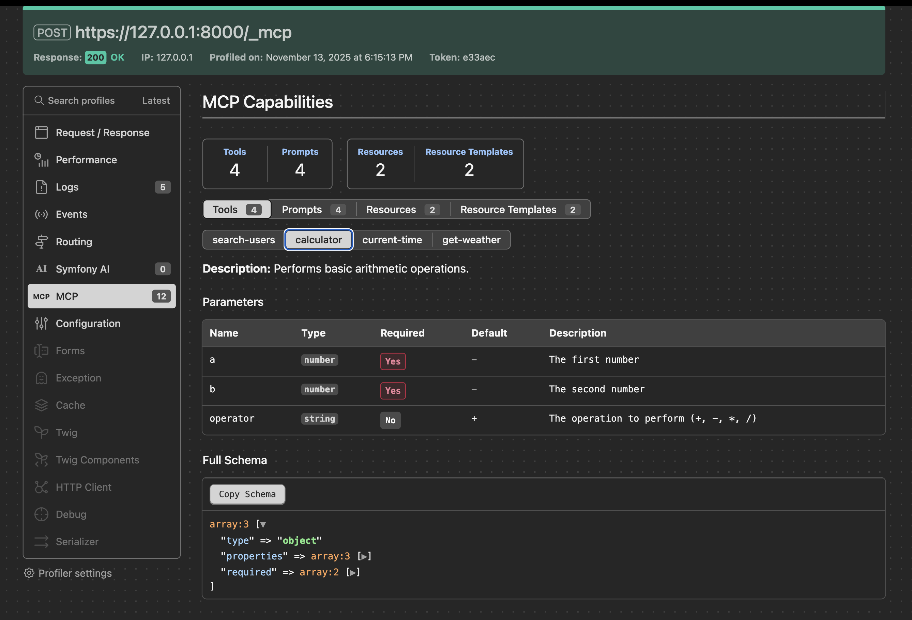

MCP Bundle
==========

Symfony integration bundle for `Model Context Protocol`_ using the official MCP SDK `mcp/sdk`_.

Supports MCP capabilities (tools, prompts, resources) as server via HTTP transport and STDIO. Resource templates implementation ready but awaiting MCP SDK support.

Installation
------------

.. code-block:: terminal

    $ composer require symfony/mcp-bundle

Usage
-----

At first, you need to decide whether your application should act as a MCP server or client. Both can be configured in
the ``mcp`` section of your ``config/packages/mcp.yaml`` file.
You also need to add few lines in the routing configuration for this bundle:

.. code-block:: yaml

    # config/routes.yaml
    mcp:
        resource: .
        type: mcp

Act as Server
~~~~~~~~~~~~~

To use your application as an MCP server, exposing tools, prompts, resources, and resource templates to clients like `Claude Desktop`_, you need to configure in the
``client_transports`` section the transports you want to expose to clients. You can use either STDIO or HTTP.

Creating MCP Capabilities
.........................

MCP capabilities are registered using PHP attributes on services: every service carrying one of the MCP attributes is
picked up automatically at container compile time. In a default Symfony application (with autoconfiguration
enabled and the classes in ``src/`` registered as services) it is enough to add the attribute to a class.

Tools
^^^^^

Actions that can be executed::

    use Mcp\Capability\Attribute\McpTool;

    class CurrentTimeTool
    {
        #[McpTool(name: 'current-time')]
        public function getCurrentTime(string $format = 'Y-m-d H:i:s'): string
        {
            return (new \DateTime('now', new \DateTimeZone('UTC')))->format($format);
        }
    }

Prompts
^^^^^^^

System instructions for AI context::

    use Mcp\Capability\Attribute\McpPrompt;

    class TimePrompts
    {
        #[McpPrompt(name: 'time-analysis')]
        public function getTimeAnalysisPrompt(): array
        {
            return [
                ['role' => 'user', 'content' => 'You are a time management expert.']
            ];
        }
    }

Resources
^^^^^^^^^

Static data that can be read::

    use Mcp\Capability\Attribute\McpResource;

    class TimeResource
    {
        #[McpResource(uri: 'time://current', name: 'current-time')]
        public function getCurrentTimeResource(): array
        {
            return [
                'uri' => 'time://current',
                'mimeType' => 'text/plain',
                'text' => (new \DateTime('now'))->format('Y-m-d H:i:s')
            ];
        }
    }

Resource Templates
^^^^^^^^^^^^^^^^^^

Dynamic resources with parameters:

.. note::

    Resource Templates are not yet functional as the underlying MCP SDK is missing the required handlers.
    See `MCP SDK issue #9 <https://github.com/modelcontextprotocol/php-sdk/issues/9>`_ for implementation status.

::

    use Mcp\Capability\Attribute\McpResourceTemplate;

    class TimeResourceTemplate
    {
        #[McpResourceTemplate(uriTemplate: 'time://{timezone}', name: 'time-by-timezone')]
        public function getTimeByTimezone(string $timezone): array
        {
            $time = (new \DateTime('now', new \DateTimeZone($timezone)))->format('Y-m-d H:i:s T');
            return [
                'uri' => "time://$timezone",
                'mimeType' => 'text/plain',
                'text' => $time
            ];
        }
    }

All capabilities are collected from the service container when it is compiled: the attributes are
reflected once, including the generation of the tool input schemas, and the result is cached in the
compiled container. Classes that are not registered as services (for example excluded in
``services.yaml`` or shipped by a third-party package) must be registered as services to be exposed.
For fully custom registration logic you can implement ``Mcp\Capability\Registry\Loader\LoaderInterface``;
implementations are autoconfigured with the ``mcp.loader`` tag and run when the server is built.

Attribute Placement Patterns
^^^^^^^^^^^^^^^^^^^^^^^^^^^^

The MCP SDK, and therefore the MCP Bundle, supports two patterns for placing attributes on your capabilities:

**Invokable Pattern** - Attribute on a class with ``__invoke()`` method::

    #[McpTool(name: 'my-tool')]
    class MyTool
    {
        public function __invoke(string $param): string
        {
            // Implementation
        }
    }

**Method-Based Pattern** - Multiple attributes on individual methods::

    class MyTools
    {
        #[McpTool(name: 'tool-one')]
        public function toolOne(): string { }

        #[McpTool(name: 'tool-two')]
        public function toolTwo(): string { }
    }

MCP Apps
........

`MCP Apps`_ let a tool return an interactive HTML screen (an "app") that the host renders in a
sandboxed iframe instead of plain text — for example a dashboard, a form, or a record viewer. The
bundle registers the underlying UI resource for you and enables the MCP Apps server extension, so you
only write the markup.

A single class is the whole app (similar to a Symfony UX LiveComponent): the ``#[AsMcpApp]`` attribute
carries the linked tool's identity (``name``/``description``) and the HTML shell (``template``), the
constructor carries service dependencies, and a handler method (``render`` by default) produces the
tool result::

    // src/Mcp/WeatherApp.php
    use Symfony\AI\McpBundle\Attribute\AsMcpApp;

    #[AsMcpApp(
        uri: 'ui://weather',
        name: 'get_weather',                 // the linked tool's name (model-facing)
        title: 'Weather',
        description: 'Show the weather for a city as an interactive dashboard.',
        template: 'mcp/weather.html.twig',
    )]
    class WeatherApp
    {
        public function __construct(private WeatherClient $weather)
        {
        }

        // The returned value is the tool result, delivered to the iframe's JS render(model).
        // The input schema is derived from the method signature.
        public function render(string $city): array
        {
            return ['summary' => $this->weather->summaryFor($city)];
        }
    }

The template extends the bundle's base template, which implements the MCP Apps ``postMessage``
handshake, iframe size reporting and a ``render(model)`` hook:

.. code-block:: html+twig

    {# templates/mcp/weather.html.twig #}
    

    .card { font: 1rem system-ui; }
    



    
        // Called with the linked tool's result. The iframe shell is static HTML; the per-request
        // data arrives at runtime via the tool-result message, not through Twig.
        function render(model) {
            document.getElementById('root').textContent = model.summary;
        }
    

The bundle registers the UI resource (with the required ``_meta.ui`` descriptor marker), registers the
tool with its ``ui`` link auto-set to this app (``resourceUri`` plus visibility ``[model, app]``), and
enables the MCP Apps extension. ``uri`` defaults to ``ui://<kebab-class-name>``; the tool ``name``
defaults to that URI slug with dashes replaced by underscores, and the handler method defaults to
``render`` (set the ``method`` argument to use another). The tool is registered only when the handler
method exists — an app without it is a static, tool-less screen.

The base template exposes the blocks ``title``, ``head``, ``style``, ``body`` and ``app_script``
(override ``render(model)`` / ``onToolInput(params)`` there), plus ``sendRpc``, ``callTool`` and
``openLink`` JavaScript helpers. The default ``render(model)`` implements the HTML-over-the-wire path
described below, and interactions are wired declaratively via ``data-call`` / ``data-open`` attributes
(see *Interactive apps* below) — so most apps write no JavaScript at all; override ``app_script`` only
for a fully JS-driven UI.

The template form requires ``symfony/twig-bundle``. For a dynamic shell, omit ``template`` and give the
class an ``__invoke(): TextResourceContents`` method instead (inject
``Symfony\AI\McpBundle\App\McpAppRenderer`` to render Twig with your own context); that method then owns
the returned content and its ``_meta.ui``.

You can declare CSP and permission requirements for the iframe directly on the attribute::

    #[AsMcpApp(
        uri: 'ui://weather',
        name: 'get_weather',
        template: 'mcp/weather.html.twig',
        prefersBorder: true,
        cspConnect: ['https://api.weather.example.com'],
        geolocation: true,
    )]

The MCP Apps extension is enabled automatically as soon as one ``#[AsMcpApp]`` class exists. Use the
``apps.enabled`` option to force it on or off:

.. code-block:: yaml

    # config/packages/mcp.yaml
    mcp:
        apps:
            enabled: true # null (default) = auto-enable when an app is registered; true/false forces it

Rendering with Twig (HTML-over-the-wire)
^^^^^^^^^^^^^^^^^^^^^^^^^^^^^^^^^^^^^^^^

The recommended way to fill the screen is to render the markup with **Twig on the server** and ship it
in the tool result, rather than building the DOM in JavaScript. The iframe shell stays static (the
protocol reads the UI resource only once), but the per-request tool result can carry an ``html``
string: the base template's default ``render(model)`` injects ``model.html`` into the ``#root`` element
(which the default ``body`` block already provides), so you write **no** client-side rendering code.

Name the fragment template on the attribute via ``toolTemplate`` and return a **context array** from the
handler — the bundle renders that template into the ``html`` field for you, so the handler stays free of
Twig::

    #[AsMcpApp(
        uri: 'ui://weather',
        name: 'get_weather',
        template: 'mcp/weather.html.twig',       // the static iframe shell
        toolTemplate: 'mcp/_weather.html.twig',   // rendered into the tool result's `html`
    )]
    class WeatherApp
    {
        public function __construct(private WeatherService $weather)
        {
        }

        // @return array{forecast: Forecast} — the Twig context, not HTML
        public function render(string $city): array
        {
            return ['forecast' => $this->weather->forecastFor($city)];
        }
    }

The shell only needs styling — the rendered fragment lands in ``#root`` automatically:

.. code-block:: html+twig

    {# templates/mcp/weather.html.twig #}
    
    .card { font: 1rem system-ui; }
    {# body defaults to 

; the rendered `html` is injected there #}

Because the markup is Twig, the fragment can ```` partials and use filters such as
``markdown_to_html`` — the same building blocks as the rest of your application. Reach for the JS
``render(model)`` override (shown above) only when you need rich client-side interactivity over a
structured model; for that case inject ``McpAppRenderer`` and return
``['html' => $renderer->renderFragment(...)]`` yourself, or build the DOM from the structured result.

Interactive apps
^^^^^^^^^^^^^^^^

Beyond the initial screen, an app can drive further work itself. Declare follow-up tools with
``#[AsMcpAppTool]`` on a method of the app class. Like the primary tool, set ``template`` to have the
bundle render the returned context into ``html``; set ``appOnly: true`` to keep the tool callable from
the app but hidden from the model's ``tools/list`` (the default exposes it to both the model and the
app)::

    use Symfony\AI\McpBundle\Attribute\AsMcpAppTool;

    // ... on the same #[AsMcpApp] class, alongside render() ...

    #[AsMcpAppTool(name: 'set_unit', template: 'mcp/_weather.html.twig', appOnly: true)]
    public function setUnit(string $city, string $unit): array
    {
        return ['forecast' => $this->weather->forecastFor($city, $unit)];
    }

The tool name defaults to the method name in ``snake_case``, its input schema is derived from the method
signature, and the ``ui`` link to the enclosing app is set automatically.

Invoking such a tool from the iframe needs **no JavaScript**: the base template wires DOM attributes to
tool calls. Put ``data-call="<tool>"`` on any control — a ``<button>``, a link, or a
``<form data-call="<tool>">`` (submitted on enter or by a submit button, including one elsewhere bound
via ``form="<id>"``) — and the returned HTML replaces ``#root`` automatically. Arguments come from
``data-arg-*`` attributes (``data-arg-city`` → ``{ city }``) or, for a form, from its named fields.
``data-open="https://…"`` opens an external link.

.. code-block:: html+twig

    <button data-call="set_unit" data-arg-city="{{ city }}" data-arg-unit="celsius">°C</button>

    {# the result HTML lands in #root; the search form below re-runs its tool on submit #}
    <form data-call="get_weather"><input name="city"><button>Go</button></form>

The default ``render(model)`` also keeps the shell's forms in sync: after each result it writes any
scalar context value into a form control of the same ``name``. So having the handler return the value it
was called with (``['city' => $city, 'forecast' => ...]``) refills ``<input name="city">`` on every
result — including the first render — with no extra wiring; a control the user is actively editing is
left untouched.

For full client-side control you can still call ``callTool(name, args)`` from your own ``app_script`` and
render the result yourself, but the declarative attributes cover the common case.

Transport Types
...............

The MCP Bundle supports two transport types for server communication:

- **STDIO Transport** - For command-line clients (e.g., ``symfony console mcp:server``)
- **HTTP Transport** - For web-based clients and MCP Inspector using streamable HTTP connections

The HTTP transport uses the MCP SDK's ``StreamableHttpTransport`` which supports:

- JSON-RPC 2.0 over HTTP POST requests
- Session management with configurable storage (file/memory/cache/framework)
- CORS headers for cross-origin requests
- Proper MCP initialization handshake

DNS Rebinding Protection
........................

By default, the MCP SDK protects the HTTP transport against DNS rebinding attacks by only
accepting requests whose ``Origin``/``Host`` header points to ``localhost``. To expose a
public MCP server, configure the allowed hosts:

.. code-block:: yaml

    mcp:
        http:
            allowed_hosts: ['example.com', 'mcp.example.com'] # Replaces the default localhost allowlist

Alternatively, disable the protection entirely (for example when the server sits behind a
reverse proxy that already validates the ``Host`` header) by setting it to ``false``:

.. code-block:: yaml

    mcp:
        http:
            allowed_hosts: false

Session Storage
...............

The MCP Bundle supports four types of session storage for the HTTP transport:

**File Storage** (default) - Stores sessions on the filesystem:

.. code-block:: yaml

    mcp:
        http:
            session:
                store: file
                directory: '%kernel.cache_dir%/mcp-sessions'
                ttl: 3600

**Memory Storage** - Stores sessions in memory (non-persistent):

.. code-block:: yaml

    mcp:
        http:
            session:
                store: memory
                ttl: 3600

**PSR-16 Cache Storage** - Stores sessions in any PSR-16 compliant cache (Redis, Doctrine, APCu, etc.):

.. code-block:: yaml

    mcp:
        http:
            session:
                store: cache
                cache_pool: 'cache.mcp.sessions' # Reference to your cache pool service (PSR-16)
                prefix: 'mcp-' # Optional prefix for cache keys
                ttl: 3600

By default, if you don't configure a custom cache pool, the bundle automatically creates ``cache.mcp.sessions`` as a PSR-16 wrapper around Symfony's default ``cache.app`` pool.

To use a custom cache backend, you need to configure a PSR-16 cache service in your ``config/services.yaml``:

.. note::

    Symfony cache pools are PSR-6 by default. The MCP session store requires PSR-16.
    Use ``Symfony\Component\Cache\Psr16Cache`` to wrap a PSR-6 pool into PSR-16.

.. code-block:: yaml

    # config/services.yaml
    services:
        # Define a custom PSR-16 cache service wrapping a PSR-6 pool
        cache.mcp.sessions:
            class: Symfony\Component\Cache\Psr16Cache
            arguments:
                - '@cache.app' # or '@my_redis_pool', '@my_doctrine_pool', etc.

This allows you to store sessions in Redis, a SQL database via Doctrine, or any other PSR-6 cache adapter.
See the `Symfony Cache documentation`_ for more details on configuring cache pools.

**Framework Storage** - Uses Symfony's ``SessionHandlerInterface`` for session persistence::

    mcp:
        http:
            session:
                store: framework
                prefix: 'mcp-' # Optional prefix for session keys
                ttl: 3600

This wraps the configured Symfony session handler (e.g. Redis, database, filesystem — whatever
your application uses for HTTP sessions) with a JSON envelope for application-level TTL.
Expired sessions are cleaned up lazily on read.

Act as Client
~~~~~~~~~~~~~

.. warning::

    Not implemented yet, but planned for the future.

To use your application as an MCP client, integrating other MCP servers, you need to configure the ``servers`` you want
to connect to. You can use either STDIO or HTTP as transport methods.

You can find a list of example Servers in the `MCP Server List`_.

Tools of those servers are available in your `AI Bundle`_ configuration and usable in your agents.

Configuration
-------------

.. code-block:: yaml

    # config/packages/mcp.yaml
    mcp:
        app: 'app' # Application name to be exposed to clients
        version: '1.0.0' # Application version to be exposed to clients
        description: 'A sample MCP server for time management.' # Application description to be exposed to clients
        icons:
            - src: 'https://example.com/icon.png' # Application icon URL
              mime_type: 'image/png' # MIME type of the icon
              sizes: ['64x64'] # Sizes of the icon
        website_url: 'https://example.com' # Application website URL
        pagination_limit: 50 # Maximum number of items returned per list request (default: 50)
        instructions: | # Instructions describing server purpose and usage context (for LLMs)
            This server provides time management capabilities for developers.

            Use when working with timestamps, time zones, or time-based calculations.
            All timestamps are in UTC unless specified otherwise.

            Example contexts: logging, debugging, time-sensitive operations.

        # MCP Apps (interactive HTML UI resources, registered with #[AsMcpApp])
        apps:
            enabled: ~ # null = auto-enable when at least one app exists; true/false forces it

        client_transports:
            stdio: true # Enable STDIO via command
            http: true # Enable HTTP transport via controller

        # HTTP transport configuration (optional)
        http:
            path: /_mcp # HTTP endpoint path (default: /_mcp)
            session:
                store: file # Session store type: 'file', 'memory', 'cache', or 'framework' (default: file)
                directory: '%kernel.cache_dir%/mcp-sessions' # Directory for file store (default: cache_dir/mcp-sessions)
                cache_pool: 'cache.mcp.sessions' # Cache pool service for cache store (default: cache.mcp.sessions)
                prefix: 'mcp-' # Prefix for cache keys (default: 'mcp-')
                ttl: 3600 # Session TTL in seconds (default: 3600)

        # Not supported yet
        servers:
            name:
                transport: 'stdio' # Transport method to use, either 'stdio' or 'http'
                stdio:
                    command: 'php /path/bin/console mcp:server' # Command to execute to start the server
                    arguments: [] # Arguments to pass to the command
                http:
                    url: 'http://localhost:8000/_mcp' # URL to HTTP endpoint of MCP server

Logging Configuration
---------------------

By default, MCP uses a dedicated logger channel that inherits your application's default logging configuration.
To configure MCP-specific logging, add the following to your ``config/packages/monolog.yaml``:

.. code-block:: yaml

    # config/packages/monolog.yaml
    monolog:
        channels: ['mcp']
        handlers:
            mcp:
                type: rotating_file
                path: '%kernel.logs_dir%/mcp.log'
                level: info
                channels: ['mcp']
                max_files: 30

You can customize the logging level and destination according to your needs:

.. code-block:: yaml

    # Example: Different levels per environment
    monolog:
        handlers:
            mcp_dev:
                type: stream
                path: '%kernel.logs_dir%/mcp.log'
                level: debug
                channels: ['mcp']
            mcp_prod:
                type: slack
                level: error
                channels: ['mcp']
                webhook_url: '%env(SLACK_WEBHOOK)%'

Debug Command
-------------

The ``debug:mcp`` command lists all MCP capabilities registered with the server — useful to verify
that an attributed class was actually picked up (only registered, autoconfigured services are):

.. code-block:: terminal

    # list all tools, prompts, resources, and resource templates with their handlers
    $ php bin/console debug:mcp

    # show the details of a single element, including the tool's input schema
    $ php bin/console debug:mcp current-time

Profiler
--------

When the Symfony Web Profiler is enabled, the MCP Bundle automatically adds a dedicated panel showing all registered MCP capabilities in your application:

The profiler displays:

- **Tools**: All registered MCP tools with their descriptions and input schemas
- **Prompts**: Available prompts with their arguments and requirements
- **Resources**: Static resources with their URIs and MIME types
- **Resource Templates**: Dynamic resource templates with URI patterns

This makes it easy to inspect and debug your MCP server capabilities during development.

Event System
------------

The MCP Bundle automatically configures the Symfony EventDispatcher to work with the MCP SDK's event system.
This allows you to listen for changes to your server's capabilities.

Available Events
~~~~~~~~~~~~~~~~

The MCP SDK dispatches the following events when capabilities are registered:

- ``Mcp\Event\ToolListChangedEvent`` - When a tool is registered
- ``Mcp\Event\ResourceListChangedEvent`` - When a resource is registered
- ``Mcp\Event\ResourceTemplateListChangedEvent`` - When a resource template is registered
- ``Mcp\Event\PromptListChangedEvent`` - When a prompt is registered

Listening to Events
~~~~~~~~~~~~~~~~~~~

You can create event listeners to respond to capability changes::

    use Mcp\Event\ToolListChangedEvent;
    use Symfony\Component\EventDispatcher\Attribute\AsEventListener;

    #[AsEventListener]
    class McpCapabilityListener
    {
        public function onToolListChanged(ToolListChangedEvent $event): void
        {
            // Handle tool registration
            // For example: invalidate cache, log changes, notify clients
        }
    }

The events are simple marker events that notify when lists have changed, but don't contain specific details about what was added or modified.

.. _`Model Context Protocol`: https://modelcontextprotocol.io/
.. _`MCP Apps`: https://github.com/modelcontextprotocol/ext-apps
.. _`mcp/sdk`: https://github.com/modelcontextprotocol/php-sdk
.. _`Claude Desktop`: https://claude.ai/download
.. _`MCP Server List`: https://modelcontextprotocol.io/examples
.. _`AI Bundle`: https://github.com/symfony/ai-bundle
.. _`Symfony Cache documentation`: https://symfony.com/doc/current/components/cache.html
