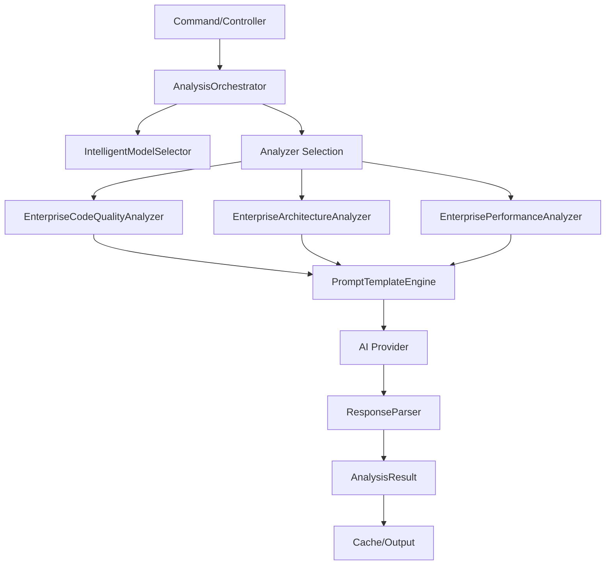

# 🤖 Enterprise AI Development Assistant Bundle

A professional-grade Symfony bundle that provides AI-powered code analysis, architecture review, and performance optimization suggestions using advanced artificial intelligence models with enterprise patterns and best practices.

## ✨ Features

### 🔍 **Intelligent Analysis Types**
- **Code Quality Analysis**: PSR compliance, best practices, maintainability assessment
- **Architecture Review**: SOLID principles, design patterns, architectural decisions
- **Performance Analysis**: Bottleneck identification, optimization opportunities
- **Comprehensive Analysis**: Parallel execution of all analysis types

### 🏗️ **Enterprise Architecture**
- **Contract-Based Design**: Proper interfaces with `AnalyzerInterface`, `ModelSelectorInterface`
- **Service Layer Pattern**: Orchestration with `AnalysisOrchestrator`
- **Intelligent Model Selection**: Automatic AI model selection based on analysis complexity
- **Caching & Rate Limiting**: Redis/Memcached integration with rate limiting protection
- **Error Handling**: Comprehensive exception handling with retry logic
- **Observability**: Detailed logging, metrics, and performance monitoring

### 🚀 **AI-Powered Intelligence**
- **Multiple AI Providers**: OpenAI, Anthropic, Google Gemini, Azure OpenAI support
- **Smart Model Selection**: Automatic selection based on task complexity and cost optimization
- **Advanced Prompting**: Specialized prompt templates for different analysis types
- **Response Parsing**: Robust parsing with fallback strategies

### ⚡ **Performance & Scalability**
- **Parallel Analysis**: Concurrent execution of multiple analysis types
- **Caching Strategy**: Intelligent caching with TTL and cache invalidation
- **Rate Limiting**: Protection against API abuse and cost control
- **Background Processing**: Non-blocking analysis execution
- **Memory Optimization**: Efficient handling of large codebases

## 📋 Requirements

- PHP 8.1 or higher
- Symfony 6.4 or higher
- Redis or Memcached (for caching)
- AI Provider API access (OpenAI, Anthropic, etc.)

## 🛠️ Installation

```bash
# Install the bundle
composer require symfony/ai-dev-assistant-bundle

# Enable the bundle (if not using Flex)
# Add to config/bundles.php:
Symfony\AI\DevAssistantBundle\DevAssistantBundle::class => ['all' => true],
```

## ⚙️ Configuration

```yaml
# config/packages/dev_assistant.yaml
dev_assistant:
  ai:
    providers:
      openai:
        api_key: '%env(OPENAI_API_KEY)%'
        model: 'gpt-4'
      anthropic:
        api_key: '%env(ANTHROPIC_API_KEY)%'
        model: 'claude-3-opus'
    
  cache:
    enabled: true
    ttl: 3600
    
  rate_limiting:
    enabled: true
    limit: 100
    window: 3600
    
  analysis:
    parallel_execution: true
    max_files_per_analysis: 50
    timeout: 300
```

## 🚀 Usage

### Command Line Interface

```bash
# Basic code quality analysis
php bin/console dev-assistant:analyze src/

# Architecture analysis with detailed output
php bin/console dev-assistant:analyze src/ --type=architecture --detailed

# Performance analysis for specific directory
php bin/console dev-assistant:analyze src/Service/ --type=performance

# Comprehensive analysis with parallel execution
php bin/console dev-assistant:analyze src/ --type=all --parallel

# Export results to JSON
php bin/console dev-assistant:analyze src/ --format=json --output=report.json

# Generate HTML report
php bin/console dev-assistant:analyze src/ --format=html --output=report.html
```

### Programmatic Usage

```php
use Symfony\AI\DevAssistantBundle\Model\AnalysisRequest;
use Symfony\AI\DevAssistantBundle\Model\AnalysisType;
use Symfony\AI\DevAssistantBundle\Service\AnalysisOrchestrator;

class CodeAnalysisService
{
    public function __construct(
        private AnalysisOrchestrator $orchestrator
    ) {}

    public function analyzeCode(array $files): AnalysisResult
    {
        $request = new AnalysisRequest(
            id: uniqid('analysis_'),
            type: AnalysisType::CODE_QUALITY,
            files: $files,
            projectType: 'symfony',
            options: ['detailed' => true]
        );

        return $this->orchestrator->analyze($request);
    }
}
```

### Service Integration

```php
// services.yaml
services:
  App\Service\MyAnalysisService:
    arguments:
      - '@dev_assistant.orchestrator'
```

## 🏛️ Architecture Overview

### Core Components

```
DevAssistantBundle/
├── Contract/
│   ├── AnalyzerInterface.php          # Analyzer contract
│   └── ModelSelectorInterface.php     # Model selection contract
├── Service/
│   ├── AnalysisOrchestrator.php       # Main orchestration service
│   ├── IntelligentModelSelector.php   # AI model selection
│   ├── PromptTemplateEngine.php       # Template management
│   └── ResponseParser.php             # AI response parsing
├── Analyzer/
│   ├── EnterpriseCodeQualityAnalyzer.php
│   ├── EnterpriseArchitectureAnalyzer.php
│   └── EnterprisePerformanceAnalyzer.php
├── Model/
│   ├── AnalysisRequest.php            # Request value object
│   ├── AnalysisResult.php             # Result value object
│   ├── Issue.php                      # Issue domain model
│   └── Suggestion.php                 # Suggestion domain model
└── Exception/
    └── AnalysisException.php          # Domain exceptions
```

### Data Flow



## 🎯 Analysis Types

### Code Quality Analysis
- **PSR Standards**: PSR-1, PSR-12 compliance checking
- **Best Practices**: Modern PHP practices, type declarations
- **Maintainability**: Cyclomatic complexity, method length
- **Documentation**: Code comments, DocBlocks quality

### Architecture Analysis  
- **SOLID Principles**: SRP, OCP, LSP, ISP, DIP compliance
- **Design Patterns**: Pattern usage and implementation quality
- **Dependency Management**: Coupling, cohesion analysis
- **Domain-Driven Design**: Entity, repository, service patterns

### Performance Analysis
- **Algorithmic Complexity**: Big O analysis, optimization opportunities
- **Database Optimization**: N+1 queries, index usage
- **Memory Management**: Memory leaks, allocation patterns
- **Caching Strategies**: Cache utilization assessment

## 📊 Output Formats

### Console Output
```
🤖 Enterprise AI Development Assistant
📊 Analysis Configuration
┌──────────────────┬─────────────────────────┐
│ Path             │ src/                    │
│ Files Found      │ 42                      │
│ Analysis Type    │ architecture            │
│ Project Type     │ symfony                 │
└──────────────────┴─────────────────────────┘

📋 Architecture Review Results
Architecture analysis reveals good adherence to SOLID principles with opportunities for improvement.

🚨 Found 3 issues
  HIGH Violation of Single Responsibility Principle
    📁 src/Controller/UserController.php:25
  MEDIUM Missing Repository Interface
    📁 src/Repository/UserRepository.php:15

💡 5 optimization suggestions
  HIGH Implement Repository Pattern
    📝 Replace direct entity manager usage with repository pattern
```

### JSON Output
```json
{
  "type": "architecture",
  "summary": "Architecture analysis reveals...",
  "confidence": 0.95,
  "architectural_score": 8.5,
  "issues": [
    {
      "id": "arch_001",
      "title": "Violation of Single Responsibility Principle",
      "severity": "high",
      "file": "src/Controller/UserController.php",
      "line": 25,
      "fix_suggestion": "Split into separate controllers"
    }
  ],
  "suggestions": [
    {
      "id": "arch_sugg_001", 
      "title": "Implement Repository Pattern",
      "priority": "high",
      "estimated_impact": 0.8
    }
  ]
}
```

## 🔧 Advanced Configuration

### Custom Analyzer

```php
use Symfony\AI\DevAssistantBundle\Contract\AnalyzerInterface;

class CustomSecurityAnalyzer implements AnalyzerInterface
{
    public function supports(AnalysisType $type): bool
    {
        return $type === AnalysisType::SECURITY;
    }

    public function analyze(AnalysisRequest $request): AnalysisResult
    {
        // Custom analysis logic
    }
}
```

### Custom Model Selector

```php
use Symfony\AI\DevAssistantBundle\Contract\ModelSelectorInterface;

class CustomModelSelector implements ModelSelectorInterface
{
    public function selectBestModel(AnalysisRequest $request): array
    {
        // Custom model selection logic
        return [
            'provider' => 'openai',
            'model' => 'gpt-4',
            'reasoning_score' => 9.5,
            'cost_efficiency' => 8.0,
        ];
    }
}
```

## 🔒 Security & Best Practices

- **API Key Management**: Secure environment variable handling
- **Rate Limiting**: Prevent API abuse and cost overruns
- **Input Validation**: Sanitize file paths and content
- **Error Handling**: Graceful degradation without exposing internals
- **Logging**: Comprehensive audit trails without sensitive data

## 🚀 Performance Optimization

- **Parallel Processing**: Concurrent analysis execution
- **Intelligent Caching**: Results caching with smart invalidation
- **Memory Management**: Efficient handling of large codebases
- **API Optimization**: Batch requests and connection pooling

## 🧪 Testing

```bash
# Run unit tests
php bin/phpunit tests/

# Run integration tests
php bin/phpunit tests/Integration/

# Performance benchmarks
php bin/console dev-assistant:benchmark
```

## 📈 Monitoring & Observability

- **Metrics Collection**: Analysis duration, success rates, model usage
- **Performance Monitoring**: Memory usage, API response times
- **Error Tracking**: Exception logging with context
- **Cost Tracking**: AI API usage and cost monitoring

## 🤝 Contributing

1. Fork the repository
2. Create a feature branch (`git checkout -b feature/amazing-feature`)
3. Follow PSR-12 coding standards
4. Add tests for new functionality
5. Update documentation
6. Submit a pull request

## 📄 License

This bundle is licensed under the MIT License. See [LICENSE](LICENSE) for details.

## 🙏 Acknowledgments

- Built on the powerful Symfony framework
- Integrates with leading AI providers
- Inspired by enterprise software development best practices
- Designed for professional development teams

---

**Built with ❤️ for the Symfony community by professional developers who understand enterprise software requirements.**
